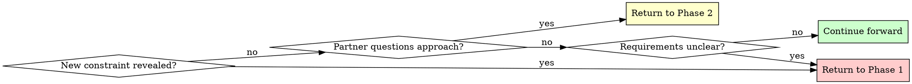

# Brainstorming Ideas Into Designs

## Overview

Transform rough ideas into fully-formed designs through structured questioning and alternative exploration.

**Core principle:** Research first, ask targeted questions to fill gaps, explore alternatives, present design incrementally for validation.

**Announce at start:** "I'm using the brainstorming skill to refine your idea into a design."

## Quick Reference

| Phase | Key Activities | Tool Usage | Output |
|-------|---------------|------------|--------|
| **Prep: Autonomous Recon** | Inspect repo/docs/commits, form initial model | Native tools (ls, cat, git log, etc.) | Draft understanding to confirm |
| **1. Understanding** | Share findings, ask only for missing context | AskUserQuestion for real decisions | Purpose, constraints, criteria (confirmed) |
| **2. Exploration** | Propose 2-3 approaches | AskUserQuestion for approach selection | Architecture options with trade-offs |
| **3. Design Presentation** | Present in 200-300 word sections | Open-ended questions | Complete design with validation |
| **4. Design Documentation** | Write design document | writing-clearly-and-concisely skill | Design doc in docs/plans/ |
| **5. Worktree Setup** | Set up isolated workspace | using-git-worktrees skill | Ready development environment |
| **6. Planning Handoff** | Create implementation plan | writing-plans skill | Detailed task breakdown |

## The Process

Copy this checklist to track progress:

```
Brainstorming Progress:
- [ ] Prep: Autonomous Recon (repo/docs/commits reviewed, initial model shared)
- [ ] Phase 1: Understanding (purpose, constraints, criteria gathered)
- [ ] Phase 2: Exploration (2-3 approaches proposed and evaluated)
- [ ] Phase 3: Design Presentation (design validated in sections)
- [ ] Phase 4: Design Documentation (design written to docs/plans/)
- [ ] Phase 5: Worktree Setup (if implementing)
- [ ] Phase 6: Planning Handoff (if implementing)
```

### Prep: Autonomous Recon
- Use existing tools (file browsing, docs, git history, tests) to understand current project state before asking anything.
- Form your draft model: what problem you're solving, what artifacts exist, and what questions remain.
- Start the conversation by sharing that model: "Based on exploring the project state, docs, working copy, and recent commits, here's how I think this should work…"
- Ask follow-up questions only for information you cannot infer from available materials.

### Phase 1: Understanding
- Share your synthesized understanding first, then invite corrections or additions.
- Ask one focused question at a time, only for gaps you cannot close yourself.
- **Use AskUserQuestion tool** only when you need the human to make a decision among real alternatives.
- Gather: Purpose, constraints, success criteria (confirmed or amended by your partner)

**Example summary + targeted question:**
```
Based on the README and yesterday's commit, we're expanding localization to dashboard and billing emails; admin console is still untouched. Only gap I see is whether support responses need localization in this iteration. Did I miss anything important?
```

### Phase 2: Exploration
- Propose 2-3 different approaches
- For each: Core architecture, trade-offs, complexity assessment, and your recommendation
- **Use AskUserQuestion tool** to present approaches when you truly need a judgement call
- Lead with the option you prefer and explain why; invite disagreement if your partner sees it differently
- Own prioritization: if the repo makes priorities clear, state them and proceed rather than asking

**Example using AskUserQuestion:**
```
Question: "Which architectural approach should we use?"
Options:
  - "Direct API calls with retry logic" (simple, synchronous, easier to debug) ← recommended for current scope
  - "Event-driven with message queue" (scalable, complex setup, eventual consistency)
  - "Hybrid with background jobs" (balanced, moderate complexity, best of both)

I recommend the direct API approach because it matches existing patterns and minimizes new infrastructure. Let me know if you see a blocker that pushes us toward the other options.
```

### Phase 3: Design Presentation
- Present in coherent sections; use ~200-300 words when introducing new material, shorter summaries once alignment is obvious
- Cover: Architecture, components, data flow, error handling, testing
- Check in at natural breakpoints rather than after every paragraph: "Stop me if this diverges from what you expect."
- Use open-ended questions to allow freeform feedback
- Assume ownership and proceed unless your partner redirects you

### Phase 4: Design Documentation
After validating the design, write it to a permanent document:
- **File location:** `docs/plans/YYYY-MM-DD-<topic>-design.md` (use actual date and descriptive topic)
- **RECOMMENDED SUB-SKILL:** Use elements-of-style:writing-clearly-and-concisely (if available) for documentation quality
- **Content:** Capture the design as discussed and validated in Phase 3, organized into sections that emerged from the conversation
- Commit the design document to git before proceeding

### Phase 5: Worktree Setup (for implementation)
When design is approved and implementation will follow:
- Announce: "I'm using the using-git-worktrees skill to set up an isolated workspace."
- **REQUIRED SUB-SKILL:** Use superpowers:using-git-worktrees
- Follow that skill's process for directory selection, safety verification, and setup
- Return here when worktree ready

### Phase 6: Planning Handoff
Ask: "Ready to create the implementation plan?"

When your human partner confirms (any affirmative response):
- Announce: "I'm using the writing-plans skill to create the implementation plan."
- **REQUIRED SUB-SKILL:** Use superpowers:writing-plans
- Create detailed plan in the worktree

## Question Patterns

### When to Use AskUserQuestion Tool

**Use AskUserQuestion when:**
- You need your partner to make a judgement call among real alternatives
- You have a recommendation and can explain why it’s your preference
- Prioritization is ambiguous and cannot be inferred from existing materials

**Best practices:**
- State your preferred option and rationale inside the question so your partner can agree or redirect
- If you know the answer from repo/docs, state it as fact and proceed—no question needed
- When priorities are spelled out, acknowledge them and proceed rather than delegating the choice back to your partner

### When to Use Open-Ended Questions

**Use open-ended questions for:**
- Phase 3: Design validation ("Does this look right so far?")
- When you need detailed feedback or explanation
- When partner should describe their own requirements
- When structured options would limit creative input

Frame them to confirm or expand your current understanding rather than reopening settled topics.

**Example decision flow:**
- "What authentication method?" → Use AskUserQuestion (2-4 options)
- "Does this design handle your use case?" → Open-ended (validation)

## When to Revisit Earlier Phases



**You can and should go backward when:**
- Partner reveals new constraint during Phase 2 or 3 → Return to Phase 1
- Validation shows fundamental gap in requirements → Return to Phase 1
- Partner questions approach during Phase 3 → Return to Phase 2
- Something doesn't make sense → Go back and clarify

**Avoid forcing forward linearly** when going backward would give better results.

## Key Principles

| Principle | Application |
|-----------|-------------|
| **One question at a time** | Phase 1: Single targeted question only for gaps you can’t close yourself |
| **Structured choices** | Use AskUserQuestion tool for 2-4 options with trade-offs |
| **YAGNI ruthlessly** | Remove unnecessary features from all designs |
| **Explore alternatives** | Always propose 2-3 approaches before settling |
| **Incremental validation** | Present design in sections, validate each |
| **Flexible progression** | Go backward when needed - flexibility > rigidity |
| **Own the initiative** | Recommend priorities and next steps; ask if you should proceed only when requirements conflict |
| **Announce usage** | State skill usage at start of session |
